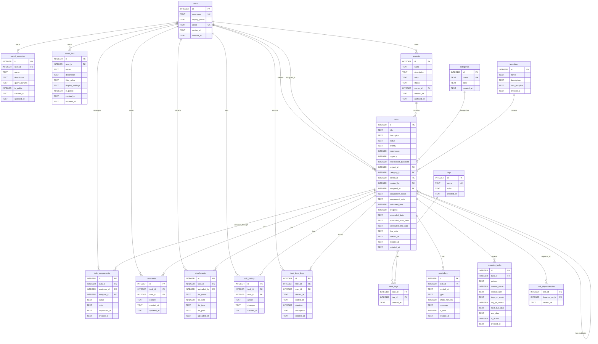

# TODO 管理 API 仕様書

## 文書情報

- バージョン: 1.0.0
- 最終更新日: 2024-01-03
- ステータス: 正式版

## 目次

1. [概要](#1-概要)
2. [技術スタック](#2-技術スタック)
3. [データベース設計](#3-データベース設計)
4. [データモデル](#4-データモデル)
5. [API エンドポイント仕様](#5-apiエンドポイント仕様)
6. [共通仕様](#6-共通仕様)

---

## 1. 概要

### 1.1 システム概要

**システム名**: TODO 管理システム  
**目的**: 個人およびチームのタスク管理を効率化する REST API システム  
**実行環境**: ローカル環境（Bun runtime）  
**データベース**: SQLite（ローカルファイル）

### 1.2 主要機能

#### タスク管理機能

- タスクの CRUD 操作（作成・読取・更新・削除）
- サブタスク管理
- タスクの依頼・担当者管理
- タスクの開始・終了予定管理
- ごみ箱機能（論理削除・復元）
- タスクの複製・一括操作

#### 分類・整理機能

- プロジェクト管理
- カテゴリー分類
- タグ付け
- アイゼンハワーマトリクスによる優先度管理

#### スケジュール・通知機能

- 繰り返しタスク
- リマインダー設定
- 時間追跡・記録

#### コラボレーション機能

- コメント
- 添付ファイル
- タスク履歴の記録

#### 分析・レポート機能

- 統計情報
- バーンダウンチャート
- ガントチャート
- 生産性分析
- KPI ダッシュボード
- 時間配分分析
- ユーザー別パフォーマンス
- プロジェクト進捗レポート

#### 検索・フィルタ機能

- 全文検索
- 高度な複合条件検索
- 自然言語検索
- 保存された検索条件
- スマートリスト（動的フィルタ）

### 1.3 仕様範囲

本仕様書は以下の内容を定義します：

- API エンドポイント仕様
- データベース設計
- データモデルと検証ルール
- エラー仕様
- データ整合性ルール

本仕様書では実装詳細、デプロイメント手順、環境構築手順は対象外とします。

---

## 2. 技術スタック

| コンポーネント     | 技術        |
| ------------------ | ----------- |
| ランタイム         | Bun         |
| Web フレームワーク | Hono        |
| プログラミング言語 | TypeScript  |
| ORM                | Drizzle ORM |
| バリデーション     | Zod         |
| データベース       | SQLite 3    |

---

## 3. データベース設計

### 3.1 設計方針

- **データベース**: SQLite 3
- **ファイル名**: `todo.db`
- **文字エンコーディング**: UTF-8
- **日付形式**: ISO 8601（タイムゾーン付き）
- **命名規則**:
  - テーブル名: 複数形、snake_case
  - カラム名: snake_case
  - インデックス名: idx*テーブル名*カラム名
  - 外部キー名: fk*子テーブル*親テーブル

### 3.2 ER 図



### 3.3 テーブル定義

#### 3.3.1 ユーザー管理

##### users（ユーザー）

| カラム名     | データ型 | NULL | デフォルト        | 説明                                                  |
| ------------ | -------- | ---- | ----------------- | ----------------------------------------------------- |
| id           | INTEGER  | NO   | AUTO_INCREMENT    | ユーザー ID（主キー）                                 |
| username     | TEXT     | NO   | -                 | ユーザー名（一意、3-50 文字、英数字とアンダースコア） |
| display_name | TEXT     | NO   | -                 | 表示名（1-100 文字）                                  |
| email        | TEXT     | NO   | -                 | メールアドレス（一意）                                |
| avatar_url   | TEXT     | YES  | NULL              | アバター画像 URL                                      |
| created_at   | TEXT     | NO   | CURRENT_TIMESTAMP | 作成日時                                              |

#### 3.3.2 タスク管理

##### tasks（タスク）

| カラム名             | データ型 | NULL | デフォルト        | 説明                                        |
| -------------------- | -------- | ---- | ----------------- | ------------------------------------------- |
| id                   | INTEGER  | NO   | AUTO_INCREMENT    | タスク ID（主キー）                         |
| title                | TEXT     | NO   | -                 | タイトル（1-100 文字）                      |
| description          | TEXT     | YES  | NULL              | 説明（最大 500 文字）                       |
| status               | TEXT     | NO   | 'TODO'            | ステータス（TODO/DOING/PENDING/DONE）       |
| priority             | TEXT     | NO   | 'medium'          | 優先度（low/medium/high）                   |
| importance           | INTEGER  | NO   | 0                 | 重要度（0:低, 1:高）                        |
| urgency              | INTEGER  | NO   | 0                 | 緊急度（0:低, 1:高）                        |
| eisenhower_quadrant  | INTEGER  | NO   | 4                 | アイゼンハワー象限（1-4、自動計算）         |
| project_id           | INTEGER  | YES  | NULL              | プロジェクト ID（外部キー）                 |
| category_id          | INTEGER  | YES  | NULL              | カテゴリー ID（外部キー）                   |
| parent_id            | INTEGER  | YES  | NULL              | 親タスク ID（外部キー、自己参照）           |
| created_by           | INTEGER  | NO   | -                 | 作成者 ID（外部キー）                       |
| assigned_to          | INTEGER  | YES  | NULL              | 担当者 ID（外部キー）                       |
| assignment_status    | TEXT     | YES  | NULL              | 依頼ステータス（pending/accepted/rejected） |
| assignment_note      | TEXT     | YES  | NULL              | 依頼メモ（最大 500 文字）                   |
| estimated_time       | INTEGER  | YES  | NULL              | 見積時間（秒）                              |
| progress             | INTEGER  | NO   | 0                 | 進捗率（0-100）                             |
| scheduled_date       | TEXT     | YES  | NULL              | 予定日（後方互換用）                        |
| scheduled_start_date | TEXT     | YES  | NULL              | 予定開始日時                                |
| scheduled_end_date   | TEXT     | YES  | NULL              | 予定終了日時                                |
| due_date             | TEXT     | YES  | NULL              | 期限                                        |
| deleted_at           | TEXT     | YES  | NULL              | 削除日時（論理削除）                        |
| created_at           | TEXT     | NO   | CURRENT_TIMESTAMP | 作成日時                                    |
| updated_at           | TEXT     | NO   | CURRENT_TIMESTAMP | 更新日時                                    |

##### task_assignments（タスク依頼）

| カラム名     | データ型 | NULL | デフォルト        | 説明                                              |
| ------------ | -------- | ---- | ----------------- | ------------------------------------------------- |
| id           | INTEGER  | NO   | AUTO_INCREMENT    | 依頼 ID（主キー）                                 |
| task_id      | INTEGER  | NO   | -                 | タスク ID（外部キー）                             |
| assignee_id  | INTEGER  | NO   | -                 | 担当者 ID（外部キー）                             |
| assigner_id  | INTEGER  | NO   | -                 | 依頼者 ID（外部キー）                             |
| status       | TEXT     | NO   | 'pending'         | ステータス（pending/accepted/rejected/completed） |
| note         | TEXT     | YES  | NULL              | 依頼メモ（最大 500 文字）                         |
| responded_at | TEXT     | YES  | NULL              | 応答日時                                          |
| created_at   | TEXT     | NO   | CURRENT_TIMESTAMP | 作成日時                                          |

##### task_history（タスク履歴）

| カラム名   | データ型 | NULL | デフォルト        | 説明                                                     |
| ---------- | -------- | ---- | ----------------- | -------------------------------------------------------- |
| id         | INTEGER  | NO   | AUTO_INCREMENT    | 履歴 ID（主キー）                                        |
| task_id    | INTEGER  | NO   | -                 | タスク ID（外部キー）                                    |
| user_id    | INTEGER  | NO   | -                 | 操作ユーザー ID（外部キー）                              |
| action     | TEXT     | NO   | -                 | アクション（created/updated/deleted/assigned/completed） |
| changes    | TEXT     | YES  | NULL              | 変更内容（JSON 形式）                                    |
| created_at | TEXT     | NO   | CURRENT_TIMESTAMP | 作成日時                                                 |

##### task_time_logs（時間記録）

| カラム名    | データ型 | NULL | デフォルト        | 説明                      |
| ----------- | -------- | ---- | ----------------- | ------------------------- |
| id          | INTEGER  | NO   | AUTO_INCREMENT    | 記録 ID（主キー）         |
| task_id     | INTEGER  | NO   | -                 | タスク ID（外部キー）     |
| user_id     | INTEGER  | NO   | -                 | 作業者 ID（外部キー）     |
| started_at  | TEXT     | NO   | -                 | 開始日時                  |
| ended_at    | TEXT     | YES  | NULL              | 終了日時                  |
| duration    | INTEGER  | YES  | NULL              | 作業時間（秒、自動計算）  |
| description | TEXT     | YES  | NULL              | 作業内容（最大 500 文字） |
| created_at  | TEXT     | NO   | CURRENT_TIMESTAMP | 作成日時                  |

##### task_dependencies（タスク依存関係）

| カラム名      | データ型 | NULL | デフォルト        | 説明                        |
| ------------- | -------- | ---- | ----------------- | --------------------------- |
| task_id       | INTEGER  | NO   | -                 | タスク ID（外部キー）       |
| depends_on_id | INTEGER  | NO   | -                 | 依存先タスク ID（外部キー） |
| created_at    | TEXT     | NO   | CURRENT_TIMESTAMP | 作成日時                    |

#### 3.3.3 分類管理

##### projects（プロジェクト）

| カラム名    | データ型 | NULL | デフォルト        | 説明                          |
| ----------- | -------- | ---- | ----------------- | ----------------------------- |
| id          | INTEGER  | NO   | AUTO_INCREMENT    | プロジェクト ID（主キー）     |
| name        | TEXT     | NO   | -                 | プロジェクト名（1-100 文字）  |
| description | TEXT     | YES  | NULL              | 説明（最大 1000 文字）        |
| color       | TEXT     | YES  | NULL              | 表示色（HEX 形式）            |
| status      | TEXT     | NO   | 'active'          | ステータス（active/archived） |
| owner_id    | INTEGER  | NO   | -                 | オーナー ID（外部キー）       |
| created_at  | TEXT     | NO   | CURRENT_TIMESTAMP | 作成日時                      |
| archived_at | TEXT     | YES  | NULL              | アーカイブ日時                |

##### categories（カテゴリー）

| カラム名   | データ型 | NULL | デフォルト        | 説明                            |
| ---------- | -------- | ---- | ----------------- | ------------------------------- |
| id         | INTEGER  | NO   | AUTO_INCREMENT    | カテゴリー ID（主キー）         |
| name       | TEXT     | NO   | -                 | カテゴリー名（一意、1-50 文字） |
| color      | TEXT     | YES  | NULL              | 表示色（HEX 形式）              |
| created_at | TEXT     | NO   | CURRENT_TIMESTAMP | 作成日時                        |

##### tags（タグ）

| カラム名   | データ型 | NULL | デフォルト        | 説明                      |
| ---------- | -------- | ---- | ----------------- | ------------------------- |
| id         | INTEGER  | NO   | AUTO_INCREMENT    | タグ ID（主キー）         |
| name       | TEXT     | NO   | -                 | タグ名（一意、1-30 文字） |
| color      | TEXT     | YES  | NULL              | 表示色（HEX 形式）        |
| created_at | TEXT     | NO   | CURRENT_TIMESTAMP | 作成日時                  |

##### task_tags（タスク-タグ関連）

| カラム名   | データ型 | NULL | デフォルト        | 説明                  |
| ---------- | -------- | ---- | ----------------- | --------------------- |
| task_id    | INTEGER  | NO   | -                 | タスク ID（外部キー） |
| tag_id     | INTEGER  | NO   | -                 | タグ ID（外部キー）   |
| created_at | TEXT     | NO   | CURRENT_TIMESTAMP | 作成日時              |

#### 3.3.4 テンプレート・繰り返し・通知

##### templates（テンプレート）

| カラム名      | データ型 | NULL | デフォルト        | 説明                            |
| ------------- | -------- | ---- | ----------------- | ------------------------------- |
| id            | INTEGER  | NO   | AUTO_INCREMENT    | テンプレート ID（主キー）       |
| name          | TEXT     | NO   | -                 | テンプレート名（1-100 文字）    |
| description   | TEXT     | YES  | NULL              | 説明（最大 500 文字）           |
| task_template | TEXT     | NO   | -                 | タスクテンプレート（JSON 形式） |
| created_at    | TEXT     | NO   | CURRENT_TIMESTAMP | 作成日時                        |

##### recurring_tasks（繰り返しタスク）

| カラム名       | データ型 | NULL | デフォルト        | 説明                                           |
| -------------- | -------- | ---- | ----------------- | ---------------------------------------------- |
| id             | INTEGER  | NO   | AUTO_INCREMENT    | 繰り返し ID（主キー）                          |
| task_id        | INTEGER  | NO   | -                 | タスク ID（外部キー）                          |
| pattern        | TEXT     | NO   | -                 | パターン（daily/weekly/monthly/yearly/custom） |
| interval_value | INTEGER  | NO   | 1                 | 間隔値                                         |
| interval_unit  | TEXT     | YES  | NULL              | 間隔単位（days/weeks/months）                  |
| days_of_week   | TEXT     | YES  | NULL              | 曜日指定（JSON 配列）                          |
| day_of_month   | INTEGER  | YES  | NULL              | 月の日付指定                                   |
| next_due_date  | TEXT     | NO   | -                 | 次回期限日                                     |
| end_date       | TEXT     | YES  | NULL              | 終了日                                         |
| is_active      | INTEGER  | NO   | 1                 | 有効フラグ（0:無効, 1:有効）                   |
| created_at     | TEXT     | NO   | CURRENT_TIMESTAMP | 作成日時                                       |

##### reminders（リマインダー）

| カラム名       | データ型 | NULL | デフォルト        | 説明                                     |
| -------------- | -------- | ---- | ----------------- | ---------------------------------------- |
| id             | INTEGER  | NO   | AUTO_INCREMENT    | リマインダー ID（主キー）                |
| task_id        | INTEGER  | NO   | -                 | タスク ID（外部キー）                    |
| remind_at      | TEXT     | NO   | -                 | リマインド日時                           |
| type           | TEXT     | NO   | 'due_date'        | タイプ（due_date/scheduled_date/custom） |
| offset_minutes | INTEGER  | YES  | NULL              | オフセット（分）                         |
| message        | TEXT     | YES  | NULL              | メッセージ（最大 200 文字）              |
| is_sent        | INTEGER  | NO   | 0                 | 送信済みフラグ（0:未送信, 1:送信済み）   |
| created_at     | TEXT     | NO   | CURRENT_TIMESTAMP | 作成日時                                 |

#### 3.3.5 コラボレーション

##### comments（コメント）

| カラム名   | データ型 | NULL | デフォルト        | 説明                    |
| ---------- | -------- | ---- | ----------------- | ----------------------- |
| id         | INTEGER  | NO   | AUTO_INCREMENT    | コメント ID（主キー）   |
| task_id    | INTEGER  | NO   | -                 | タスク ID（外部キー）   |
| user_id    | INTEGER  | NO   | -                 | ユーザー ID（外部キー） |
| content    | TEXT     | NO   | -                 | 内容（1-1000 文字）     |
| created_at | TEXT     | NO   | CURRENT_TIMESTAMP | 作成日時                |
| updated_at | TEXT     | NO   | CURRENT_TIMESTAMP | 更新日時                |

##### attachments（添付ファイル）

| カラム名    | データ型 | NULL | デフォルト        | 説明                          |
| ----------- | -------- | ---- | ----------------- | ----------------------------- |
| id          | INTEGER  | NO   | AUTO_INCREMENT    | ファイル ID（主キー）         |
| task_id     | INTEGER  | NO   | -                 | タスク ID（外部キー）         |
| uploaded_by | INTEGER  | NO   | -                 | アップロード者 ID（外部キー） |
| file_name   | TEXT     | NO   | -                 | ファイル名（最大 255 文字）   |
| file_size   | INTEGER  | NO   | -                 | ファイルサイズ（バイト）      |
| file_type   | TEXT     | NO   | -                 | MIME タイプ                   |
| file_path   | TEXT     | NO   | -                 | ファイルパス                  |
| uploaded_at | TEXT     | NO   | CURRENT_TIMESTAMP | アップロード日時              |

#### 3.3.6 検索・フィルタ

##### saved_searches（保存検索）

| カラム名     | データ型 | NULL | デフォルト        | 説明                           |
| ------------ | -------- | ---- | ----------------- | ------------------------------ |
| id           | INTEGER  | NO   | AUTO_INCREMENT    | 検索 ID（主キー）              |
| user_id      | INTEGER  | NO   | -                 | ユーザー ID（外部キー）        |
| name         | TEXT     | NO   | -                 | 検索名（1-100 文字）           |
| description  | TEXT     | YES  | NULL              | 説明（最大 500 文字）          |
| query_params | TEXT     | NO   | -                 | 検索条件（JSON 形式）          |
| is_public    | INTEGER  | NO   | 0                 | 公開フラグ（0:非公開, 1:公開） |
| created_at   | TEXT     | NO   | CURRENT_TIMESTAMP | 作成日時                       |
| updated_at   | TEXT     | NO   | CURRENT_TIMESTAMP | 更新日時                       |

##### smart_lists（スマートリスト）

| カラム名         | データ型 | NULL | デフォルト        | 説明                           |
| ---------------- | -------- | ---- | ----------------- | ------------------------------ |
| id               | INTEGER  | NO   | AUTO_INCREMENT    | リスト ID（主キー）            |
| user_id          | INTEGER  | NO   | -                 | ユーザー ID（外部キー）        |
| name             | TEXT     | NO   | -                 | リスト名（1-100 文字）         |
| description      | TEXT     | YES  | NULL              | 説明（最大 500 文字）          |
| filter_rules     | TEXT     | NO   | -                 | フィルタールール（JSON 形式）  |
| display_settings | TEXT     | YES  | NULL              | 表示設定（JSON 形式）          |
| is_public        | INTEGER  | NO   | 0                 | 公開フラグ（0:非公開, 1:公開） |
| created_at       | TEXT     | NO   | CURRENT_TIMESTAMP | 作成日時                       |
| updated_at       | TEXT     | NO   | CURRENT_TIMESTAMP | 更新日時                       |

### 3.4 インデックス設計

#### タスク関連

- `idx_tasks_status`: ステータス検索用
- `idx_tasks_importance`: 重要度検索用
- `idx_tasks_urgency`: 緊急度検索用
- `idx_tasks_eisenhower`: アイゼンハワー象限検索用
- `idx_tasks_project`: プロジェクト別検索用
- `idx_tasks_category`: カテゴリー別検索用
- `idx_tasks_parent`: サブタスク検索用
- `idx_tasks_created_by`: 作成者別検索用
- `idx_tasks_assigned_to`: 担当者別検索用
- `idx_tasks_assignment_status`: 依頼ステータス検索用
- `idx_tasks_scheduled_start_date`: 予定開始日時検索用
- `idx_tasks_scheduled_end_date`: 予定終了日時検索用
- `idx_tasks_due_date`: 期限検索用
- `idx_tasks_deleted_at`: 削除済み検索用
- `idx_tasks_created_at`: 作成日時検索用

#### その他のインデックス

- ユーザー: `idx_users_username`, `idx_users_email`
- プロジェクト: `idx_projects_name`, `idx_projects_status`, `idx_projects_owner`
- カテゴリー: `idx_categories_name`
- タグ: `idx_tags_name`
- タスクタグ: `idx_task_tags_task`, `idx_task_tags_tag`
- 依頼: `idx_task_assignments_assignee`, `idx_task_assignments_assigner`, `idx_task_assignments_status`
- 履歴: `idx_task_history_task`, `idx_task_history_created_at`
- 時間記録: `idx_task_time_logs_task`, `idx_task_time_logs_started_at`
- 保存検索: `idx_saved_searches_user`, `idx_saved_searches_public`
- スマートリスト: `idx_smart_lists_user`, `idx_smart_lists_public`

### 3.5 制約設計

#### 外部キー制約

| 外部キー                     | 参照先        | 削除時の動作 |
| ---------------------------- | ------------- | ------------ |
| tasks.project_id             | projects.id   | SET NULL     |
| tasks.category_id            | categories.id | SET NULL     |
| tasks.parent_id              | tasks.id      | CASCADE      |
| tasks.created_by             | users.id      | RESTRICT     |
| tasks.assigned_to            | users.id      | SET NULL     |
| task_assignments.task_id     | tasks.id      | CASCADE      |
| task_assignments.assignee_id | users.id      | CASCADE      |
| task_assignments.assigner_id | users.id      | CASCADE      |
| projects.owner_id            | users.id      | RESTRICT     |
| その他の外部キー             | 各親テーブル  | CASCADE      |

#### ユニーク制約

- `users.username`
- `users.email`
- `categories.name`
- `tags.name`
- `task_tags.(task_id, tag_id)`

### 3.6 トリガー

#### アイゼンハワー象限の自動計算

```sql
CREATE TRIGGER calculate_eisenhower_quadrant
BEFORE INSERT OR UPDATE ON tasks
FOR EACH ROW
BEGIN
  SET NEW.eisenhower_quadrant = CASE
    WHEN NEW.importance = 1 AND NEW.urgency = 1 THEN 1
    WHEN NEW.importance = 1 AND NEW.urgency = 0 THEN 2
    WHEN NEW.importance = 0 AND NEW.urgency = 1 THEN 3
    ELSE 4
  END;
END;
```

#### 更新日時の自動更新

```sql
CREATE TRIGGER update_tasks_updated_at
AFTER UPDATE ON tasks
FOR EACH ROW
BEGIN
  UPDATE tasks SET updated_at = CURRENT_TIMESTAMP WHERE id = NEW.id;
END;
```

#### 時間記録の期間自動計算

```sql
CREATE TRIGGER calculate_duration
BEFORE UPDATE ON task_time_logs
FOR EACH ROW
WHEN NEW.ended_at IS NOT NULL AND OLD.ended_at IS NULL
BEGIN
  SET NEW.duration = CAST((julianday(NEW.ended_at) - julianday(NEW.started_at)) * 86400 AS INTEGER);
END;
```

### 3.7 初期データ

```sql
-- デフォルトユーザー
INSERT INTO users (username, display_name, email) VALUES
('admin', '管理者', 'admin@example.com'),
('user1', 'ユーザー1', 'user1@example.com');

-- デフォルトカテゴリー
INSERT INTO categories (name, color) VALUES
('仕事', '#FF5733'),
('プライベート', '#33FF57'),
('買い物', '#3357FF'),
('勉強', '#FF33F5');

-- デフォルトタグ
INSERT INTO tags (name, color) VALUES
('重要', '#FF0000'),
('緊急', '#FFA500'),
('保留中', '#808080'),
('レビュー待ち', '#0000FF');
```

---

## 4. データモデル

### 4.1 データ検証ルール

#### タスク

| フィールド         | 必須 | 型       | 制約                        |
| ------------------ | ---- | -------- | --------------------------- |
| title              | ○    | 文字列   | 1-100 文字                  |
| description        | -    | 文字列   | 最大 500 文字               |
| status             | -    | 列挙型   | TODO/DOING/PENDING/DONE     |
| priority           | -    | 列挙型   | low/medium/high             |
| importance         | -    | 真偽値   | -                           |
| urgency            | -    | 真偽値   | -                           |
| projectId          | -    | 整数     | 存在するプロジェクト ID     |
| categoryId         | -    | 整数     | 存在するカテゴリー ID       |
| parentId           | -    | 整数     | 存在するタスク ID           |
| assignedTo         | -    | 整数     | 存在するユーザー ID         |
| assignmentNote     | -    | 文字列   | 最大 500 文字               |
| tagIds             | -    | 整数配列 | 存在するタグ ID             |
| estimatedTime      | -    | 整数     | 正の整数（秒）              |
| progress           | -    | 整数     | 0-100                       |
| scheduledStartDate | -    | 日時     | ISO 8601 形式               |
| scheduledEndDate   | -    | 日時     | ISO 8601 形式、開始日時以降 |
| dueDate            | -    | 日時     | ISO 8601 形式               |

#### ユーザー

| フィールド  | 必須 | 型     | 制約                              |
| ----------- | ---- | ------ | --------------------------------- |
| username    | ○    | 文字列 | 3-50 文字、英数字とアンダースコア |
| displayName | ○    | 文字列 | 1-100 文字                        |
| email       | ○    | 文字列 | 有効なメールアドレス形式          |
| avatarUrl   | -    | 文字列 | 有効な URL 形式                   |

#### プロジェクト

| フィールド  | 必須 | 型     | 制約                        |
| ----------- | ---- | ------ | --------------------------- |
| name        | ○    | 文字列 | 1-100 文字                  |
| description | -    | 文字列 | 最大 1000 文字              |
| color       | -    | 文字列 | HEX カラーコード（#RRGGBB） |
| status      | -    | 列挙型 | active/archived             |

#### カテゴリー

| フィールド | 必須 | 型     | 制約                        |
| ---------- | ---- | ------ | --------------------------- |
| name       | ○    | 文字列 | 1-50 文字                   |
| color      | -    | 文字列 | HEX カラーコード（#RRGGBB） |

#### タグ

| フィールド | 必須 | 型     | 制約                        |
| ---------- | ---- | ------ | --------------------------- |
| name       | ○    | 文字列 | 1-30 文字                   |
| color      | -    | 文字列 | HEX カラーコード（#RRGGBB） |

### 4.2 ビジネスルール

#### タスク管理

- アイゼンハワー象限は重要度と緊急度から自動計算される
- 削除済みタスクは更新不可（復元後のみ可能）
- ステータスが DONE のタスクは優先度変更不可
- 予定終了日時は予定開始日時以降でなければならない
- 進捗率は 0-100 の範囲内

#### 依頼管理

- 自分自身へのタスク依頼は不可
- 同一タスクへの重複依頼は不可
- 依頼者以外は依頼を取り消し不可
- 担当者以外は依頼に応答不可

#### 時間記録

- 終了時刻は開始時刻より後でなければならない
- 同一タスクで重複する時間帯の記録は不可

#### 依存関係

- 循環依存は禁止（A→B→C→A のような依存関係）

---

## 5. API エンドポイント仕様

### 5.1 エンドポイント一覧

#### ユーザー管理

| メソッド | パス               | 説明               |
| -------- | ------------------ | ------------------ |
| GET      | /api/users         | ユーザー一覧取得   |
| GET      | /api/users/:id     | ユーザー詳細取得   |
| POST     | /api/users         | ユーザー作成       |
| PUT      | /api/users/:id     | ユーザー更新       |
| DELETE   | /api/users/:id     | ユーザー削除       |
| GET      | /api/users/current | 現在のユーザー取得 |

#### タスク管理

| メソッド | パス                         | 説明                         |
| -------- | ---------------------------- | ---------------------------- |
| GET      | /api/tasks                   | タスク一覧取得               |
| GET      | /api/tasks/:id               | タスク詳細取得               |
| POST     | /api/tasks                   | タスク作成                   |
| PUT      | /api/tasks/:id               | タスク更新                   |
| DELETE   | /api/tasks/:id               | タスク削除（ごみ箱へ）       |
| POST     | /api/tasks/:id/restore       | タスク復元                   |
| DELETE   | /api/tasks/:id/permanent     | タスク完全削除               |
| GET      | /api/tasks/trash             | ごみ箱一覧取得               |
| POST     | /api/tasks/trash/empty       | ごみ箱を空にする             |
| GET      | /api/tasks/:id/subtasks      | サブタスク一覧取得           |
| POST     | /api/tasks/:id/update-status | ステータス更新               |
| GET      | /api/tasks/:id/history       | 履歴取得                     |
| GET      | /api/tasks/eisenhower-matrix | アイゼンハワーマトリクス取得 |
| POST     | /api/tasks/:id/duplicate     | タスク複製                   |
| POST     | /api/tasks/bulk-update       | 一括更新                     |
| POST     | /api/tasks/bulk-delete       | 一括削除                     |
| POST     | /api/tasks/:id/assign        | タスク依頼                   |
| GET      | /api/tasks/assigned-to-me    | 依頼されたタスク一覧         |
| GET      | /api/tasks/assigned-by-me    | 依頼したタスク一覧           |

#### タスク依頼

| メソッド | パス                               | 説明         |
| -------- | ---------------------------------- | ------------ |
| GET      | /api/task-assignments              | 依頼一覧取得 |
| GET      | /api/task-assignments/:id          | 依頼詳細取得 |
| POST     | /api/task-assignments/:id/accept   | 依頼承諾     |
| POST     | /api/task-assignments/:id/reject   | 依頼拒否     |
| POST     | /api/task-assignments/:id/complete | 依頼完了     |
| DELETE   | /api/task-assignments/:id          | 依頼取消     |

#### 分類管理

| メソッド | パス                | 説明               |
| -------- | ------------------- | ------------------ |
| GET      | /api/categories     | カテゴリー一覧取得 |
| GET      | /api/categories/:id | カテゴリー詳細取得 |
| POST     | /api/categories     | カテゴリー作成     |
| PUT      | /api/categories/:id | カテゴリー更新     |
| DELETE   | /api/categories/:id | カテゴリー削除     |
| GET      | /api/tags           | タグ一覧取得       |
| POST     | /api/tags           | タグ作成           |
| PUT      | /api/tags/:id       | タグ更新           |
| DELETE   | /api/tags/:id       | タグ削除           |

#### プロジェクト管理

| メソッド | パス                      | 説明                     |
| -------- | ------------------------- | ------------------------ |
| GET      | /api/projects             | プロジェクト一覧取得     |
| GET      | /api/projects/:id         | プロジェクト詳細取得     |
| POST     | /api/projects             | プロジェクト作成         |
| PUT      | /api/projects/:id         | プロジェクト更新         |
| DELETE   | /api/projects/:id         | プロジェクト削除         |
| GET      | /api/projects/:id/tasks   | プロジェクトのタスク取得 |
| POST     | /api/projects/:id/archive | プロジェクトアーカイブ   |

#### 時間記録

| メソッド | パス                                | 説明                 |
| -------- | ----------------------------------- | -------------------- |
| POST     | /api/tasks/:id/time-logs/start      | 作業開始             |
| PUT      | /api/tasks/:id/time-logs/:logId/end | 作業終了             |
| GET      | /api/tasks/:id/time-logs            | タスクの時間記録取得 |
| DELETE   | /api/time-logs/:logId               | 時間記録削除         |
| GET      | /api/time-logs                      | 全時間記録取得       |
| PUT      | /api/time-logs/:logId               | 時間記録編集         |

#### テンプレート・繰り返し

| メソッド | パス                            | 説明                   |
| -------- | ------------------------------- | ---------------------- |
| GET      | /api/templates                  | テンプレート一覧取得   |
| GET      | /api/templates/:id              | テンプレート詳細取得   |
| POST     | /api/templates                  | テンプレート作成       |
| PUT      | /api/templates/:id              | テンプレート更新       |
| DELETE   | /api/templates/:id              | テンプレート削除       |
| POST     | /api/templates/:id/apply        | テンプレート適用       |
| GET      | /api/recurring-tasks            | 繰り返しタスク一覧取得 |
| POST     | /api/recurring-tasks            | 繰り返しタスク作成     |
| PUT      | /api/recurring-tasks/:id        | 繰り返しタスク更新     |
| DELETE   | /api/recurring-tasks/:id        | 繰り返しタスク削除     |
| POST     | /api/recurring-tasks/:id/pause  | 繰り返し一時停止       |
| POST     | /api/recurring-tasks/:id/resume | 繰り返し再開           |

#### リマインダー

| メソッド | パス                     | 説明                   |
| -------- | ------------------------ | ---------------------- |
| GET      | /api/tasks/:id/reminders | リマインダー一覧取得   |
| POST     | /api/tasks/:id/reminders | リマインダー設定       |
| PUT      | /api/reminders/:id       | リマインダー更新       |
| DELETE   | /api/reminders/:id       | リマインダー削除       |
| GET      | /api/reminders/upcoming  | 今後のリマインダー取得 |

#### コメント・添付ファイル

| メソッド | パス                       | 説明                 |
| -------- | -------------------------- | -------------------- |
| GET      | /api/tasks/:id/comments    | コメント一覧取得     |
| POST     | /api/tasks/:id/comments    | コメント追加         |
| PUT      | /api/comments/:id          | コメント更新         |
| DELETE   | /api/comments/:id          | コメント削除         |
| GET      | /api/tasks/:id/attachments | 添付ファイル一覧取得 |
| POST     | /api/tasks/:id/attachments | ファイル添付         |
| GET      | /api/attachments/:id       | 添付ファイル取得     |
| DELETE   | /api/attachments/:id       | 添付ファイル削除     |

#### 統計・レポート

| メソッド | パス                           | 説明                         |
| -------- | ------------------------------ | ---------------------------- |
| GET      | /api/stats                     | 統計情報取得                 |
| GET      | /api/stats/daily               | 日別統計取得                 |
| GET      | /api/stats/time-summary        | 時間記録サマリー取得         |
| GET      | /api/reports/burndown          | バーンダウンチャート取得     |
| GET      | /api/reports/gantt             | ガントチャート取得           |
| GET      | /api/reports/productivity      | 生産性分析取得               |
| GET      | /api/reports/kpi-dashboard     | KPI ダッシュボード取得       |
| GET      | /api/reports/time-distribution | 時間配分分析取得             |
| GET      | /api/reports/user-performance  | ユーザー別パフォーマンス取得 |
| GET      | /api/reports/project-progress  | プロジェクト進捗取得         |
| POST     | /api/reports/export            | レポートエクスポート         |

#### 検索・フィルタ

| メソッド | パス                            | 説明                       |
| -------- | ------------------------------- | -------------------------- |
| GET      | /api/search                     | 全文検索                   |
| POST     | /api/search/advanced            | 高度な検索                 |
| GET      | /api/search/natural-language    | 自然言語検索               |
| GET      | /api/saved-searches             | 保存検索一覧取得           |
| GET      | /api/saved-searches/:id         | 保存検索詳細取得           |
| POST     | /api/saved-searches             | 検索条件保存               |
| PUT      | /api/saved-searches/:id         | 保存検索更新               |
| DELETE   | /api/saved-searches/:id         | 保存検索削除               |
| POST     | /api/saved-searches/:id/execute | 保存検索実行               |
| GET      | /api/smart-lists                | スマートリスト一覧取得     |
| GET      | /api/smart-lists/:id            | スマートリスト詳細取得     |
| POST     | /api/smart-lists                | スマートリスト作成         |
| PUT      | /api/smart-lists/:id            | スマートリスト更新         |
| DELETE   | /api/smart-lists/:id            | スマートリスト削除         |
| GET      | /api/smart-lists/:id/tasks      | スマートリストのタスク取得 |

#### システム

| メソッド | パス              | 説明               |
| -------- | ----------------- | ------------------ |
| GET      | /api/health       | ヘルスチェック     |
| POST     | /api/backup       | バックアップ作成   |
| POST     | /api/restore      | バックアップ復元   |
| GET      | /api/export/tasks | タスクエクスポート |
| POST     | /api/import/tasks | タスクインポート   |

### 5.2 主要エンドポイント詳細

#### GET /api/tasks

タスク一覧を取得します。

**クエリパラメータ**
| パラメータ | 型 | 説明 |
|-----------|-----|------|
| status | 文字列 | ステータスフィルタ（TODO/DOING/PENDING/DONE） |
| importance | 真偽値 | 重要度フィルタ |
| urgency | 真偽値 | 緊急度フィルタ |
| eisenhowerQuadrant | 整数 | アイゼンハワー象限フィルタ（1-4） |
| categoryId | 整数 | カテゴリー ID フィルタ |
| projectId | 整数 | プロジェクト ID フィルタ |
| tagId | 整数 | タグ ID フィルタ（単一） |
| tagIds | 文字列 | タグ ID フィルタ（複数、カンマ区切り） |
| parentId | 整数/null | 親タスク ID フィルタ |
| priority | 文字列 | 優先度フィルタ（low/medium/high） |
| search | 文字列 | タイトル・説明の部分一致検索 |
| q | 文字列 | 全文検索クエリ |
| createdBy | 整数 | 作成者 ID フィルタ |
| assignedTo | 整数 | 担当者 ID フィルタ |
| assignmentStatus | 文字列 | 依頼ステータスフィルタ |
| scheduledStartFrom | 日時 | 予定開始日時の範囲開始 |
| scheduledStartTo | 日時 | 予定開始日時の範囲終了 |
| scheduledEndFrom | 日時 | 予定終了日時の範囲開始 |
| scheduledEndTo | 日時 | 予定終了日時の範囲終了 |
| dueDateFrom | 日時 | 期限の範囲開始 |
| dueDateTo | 日時 | 期限の範囲終了 |
| hasAttachments | 真偽値 | 添付ファイルありフィルタ |
| hasComments | 真偽値 | コメントありフィルタ |
| isOverdue | 真偽値 | 期限切れフィルタ |
| progressMin | 整数 | 最小進捗率 |
| progressMax | 整数 | 最大進捗率 |
| includeSubtasks | 真偽値 | サブタスクを含める |
| includeDeleted | 真偽値 | 削除済みを含める |
| deletedOnly | 真偽値 | 削除済みのみ |
| sortBy | 文字列 | ソート基準 |
| order | 文字列 | ソート順（asc/desc） |
| limit | 整数 | 取得件数（最大 100） |
| offset | 整数 | オフセット |

**レスポンス例**

```json
{
  "tasks": [
    {
      "id": 1,
      "title": "タスクのタイトル",
      "description": "タスクの説明",
      "status": "TODO",
      "priority": "medium",
      "importance": true,
      "urgency": false,
      "eisenhowerQuadrant": 2,
      "categoryId": 1,
      "projectId": null,
      "parentId": null,
      "createdBy": 1,
      "assignedTo": 2,
      "assignmentStatus": "accepted",
      "estimatedTime": 3600,
      "progress": 0,
      "scheduledStartDate": "2024-12-30T09:00:00Z",
      "scheduledEndDate": "2024-12-30T18:00:00Z",
      "dueDate": "2024-12-31T23:59:59Z",
      "creator": {
        "id": 1,
        "username": "user1",
        "displayName": "ユーザー1"
      },
      "assignee": {
        "id": 2,
        "username": "user2",
        "displayName": "ユーザー2"
      },
      "category": {
        "id": 1,
        "name": "仕事",
        "color": "#FF5733"
      },
      "tags": [
        {
          "id": 1,
          "name": "重要",
          "color": "#FF0000"
        }
      ],
      "subtaskCount": 3,
      "completedSubtaskCount": 1,
      "deletedAt": null,
      "createdAt": "2024-01-01T00:00:00Z",
      "updatedAt": "2024-01-01T00:00:00Z"
    }
  ],
  "total": 100,
  "limit": 50,
  "offset": 0
}
```

#### POST /api/tasks

新規タスクを作成します。

**リクエストボディ例**

```json
{
  "title": "新しいタスク",
  "description": "タスクの説明",
  "status": "TODO",
  "priority": "high",
  "importance": true,
  "urgency": false,
  "categoryId": 1,
  "projectId": 1,
  "parentId": null,
  "assignedTo": 2,
  "assignmentNote": "このタスクをお願いします",
  "tagIds": [1, 2],
  "estimatedTime": 7200,
  "scheduledStartDate": "2024-12-30T09:00:00Z",
  "scheduledEndDate": "2024-12-30T18:00:00Z",
  "dueDate": "2024-12-31T23:59:59Z"
}
```

### 5.3 スマートリスト演算子

| 演算子              | 説明       | 対象フィールド |
| ------------------- | ---------- | -------------- |
| equals              | 等しい     | すべて         |
| notEquals           | 等しくない | すべて         |
| contains            | 含む       | 文字列、配列   |
| notContains         | 含まない   | 文字列、配列   |
| startsWith          | で始まる   | 文字列         |
| endsWith            | で終わる   | 文字列         |
| greaterThan         | より大きい | 数値、日付     |
| lessThan            | より小さい | 数値、日付     |
| greaterThanOrEquals | 以上       | 数値、日付     |
| lessThanOrEquals    | 以下       | 数値、日付     |
| between             | 範囲内     | 数値、日付     |
| isNull              | NULL       | すべて         |
| isNotNull           | NULL 以外  | すべて         |
| isToday             | 今日       | 日付           |
| isTomorrow          | 明日       | 日付           |
| isThisWeek          | 今週       | 日付           |
| isNextWeek          | 来週       | 日付           |
| isThisMonth         | 今月       | 日付           |
| isOverdue           | 期限切れ   | 日付           |

---

## 6. 共通仕様

### 6.1 レスポンス形式

#### 成功レスポンス

HTTP ステータス 2xx で、要求されたデータを JSON 形式で返します。

#### エラーレスポンス

```json
{
  "error": {
    "code": "ERROR_CODE",
    "message": "エラーメッセージ",
    "details": [
      {
        "field": "フィールド名",
        "message": "詳細メッセージ"
      }
    ]
  }
}
```

### 6.2 エラーコード

| コード              | HTTP ステータス | 説明                   |
| ------------------- | --------------- | ---------------------- |
| VALIDATION_ERROR    | 400             | 入力値検証エラー       |
| NOT_FOUND           | 404             | リソースが見つからない |
| ALREADY_DELETED     | 404             | 既に削除済み           |
| ALREADY_ASSIGNED    | 400             | 既に依頼済み           |
| SELF_ASSIGNMENT     | 400             | 自分自身への依頼       |
| UNAUTHORIZED_ACTION | 403             | 権限のない操作         |
| ASSIGNMENT_CONFLICT | 409             | 依頼の競合             |
| INVALID_DATE_RANGE  | 400             | 不正な日時範囲         |
| INTERNAL_ERROR      | 500             | サーバー内部エラー     |

### 6.3 共通ヘッダー

#### リクエストヘッダー

```
Content-Type: application/json
Accept: application/json
```

#### レスポンスヘッダー

```
Content-Type: application/json; charset=utf-8
```

### 6.4 日時フォーマット

すべての日時は ISO 8601 形式（タイムゾーン付き）で扱います。
例: `2024-01-01T09:00:00Z`

### 6.5 ページネーション

- `limit`: 取得件数（デフォルト: 50、最大: 100）
- `offset`: 開始位置（デフォルト: 0）

レスポンスには `total`（総件数）を含めます。

### 6.6 認証

現在のバージョンでは認証は実装されていません。
すべてのエンドポイントは認証なしでアクセス可能です。

---

以上
